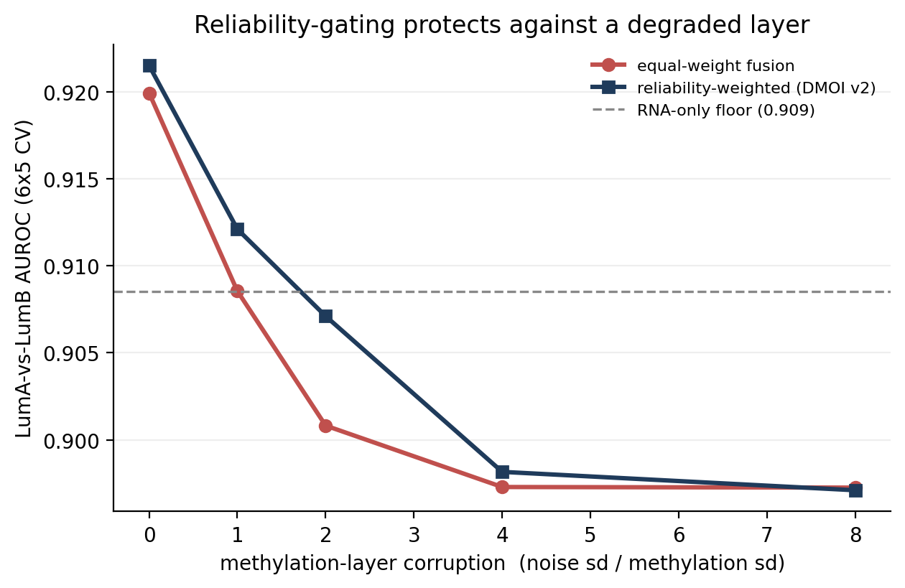
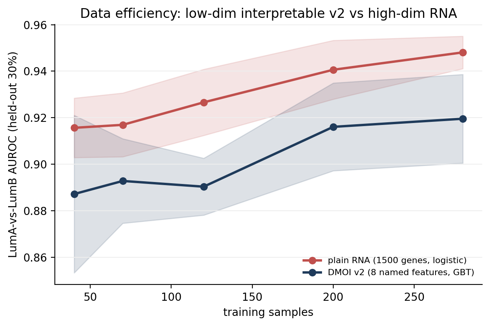

# DMOI — Method Assessment & Improvement Roadmap

*A standalone methods memo. Context: the GSE57577 (Noh et al. 2015) reproduction surfaced a multi-omics coupling that DMOI was asked to rescue. Two controlled experiments were run to assess the method itself. June 2026.*

---

## 1. What DMOI is

DMOI (Dialectical Multi-Omics Integration) is a structured fusion of RNA and methylation. For each biological "pole" (a gene-set axis) it builds three scalars per sample: an RNA score, a methylation score, and their **disagreement** `z_RNA − z_meth` — a feature that foregrounds where the two layers *contradict* (e.g. "expressed but not methylated"). This dialectical framing is genuinely distinctive: MOFA / iCluster / naïve concatenation look for what the layers *share*, whereas DMOI's signature feature encodes where they *diverge*.

The question this memo answers: **does that disagreement feature earn its keep, and if not, what should replace it?**

---

## 2. Evidence — two controlled experiments

### Experiment A — TCGA-BRCA LumA vs LumB (well-measured data)
RNA (HiSeqV2) + HM450 methylation, n = 417, ER + proliferation poles, 12×5 repeated-CV AUROC, paired Wilcoxon vs the `RNA+meth` linear baseline.

| Feature set (logistic) | AUROC | Δ vs base | p |
|---|---|---|---|
| RNA + meth (4, linear) | **0.9134** | — | — |
| + disagreement = *difference* (6) | 0.9134 | **+0.0000** | 0.68 |
| + concordance = *product* (6) | 0.9105 | −0.0029 | 4.9e-4 |
| **GBT on RNA + meth (nonlinear)** | **0.9239** | **+0.0105** | 4.9e-4 |
| *(context) plain ~1500-gene RNA* | *0.940* | *—* | *—* |

### Experiment B — GSE57577 gene-level (shallow data)
Predict WWD-vs-WT `log2FC` from per-gene `[Δoccupancy, Δmethylation]`, n = 12,039, 10×5 out-of-fold CV R².

| Model | R² | Spearman(pred,y) | Δ vs base |
|---|---|---|---|
| meth only (1, linear) | +0.0036 | +0.068 | +0.0000 |
| occ + meth (2, linear) | +0.0036 | +0.056 | — |
| + difference (3, linear) | +0.0036 | +0.056 | **−0.0000** |
| + product (3, linear) | +0.0034 | +0.053 | −0.0002 |
| GBT (nonlinear) | **−0.0049** | +0.056 | −0.0085 |

### What the two experiments establish

1. **The disagreement-as-linear-feature contributes exactly zero** — Δ = +0.0000 in *both* the BRCA AUROC and the GSE57577 R². This is not bad luck: `z_RNA − z_meth` lies in the linear span of `{z_RNA, z_meth}`, so it is provably redundant for any linear model. The repo's own benchmark already hinted at it (0.9161 vs 0.9166); here it is pinned to zero to four decimals.
2. **Cross-omics interaction is real but only *nonlinearly* accessible.** On well-measured BRCA, a gradient-boosted model extracts a small, reproducible gain from the *same* four features (+0.011 AUROC, p < 0.001) that no linear feature — difference or product — can deliver.
3. **On under-powered data there is nothing to model.** On shallow GSE57577 (n = 2 replicates, promoter methylation near floor) every approach sits at R² ≈ 0 and the nonlinear model *overfits to noise* (negative R²). No learner — linear, interaction, or nonlinear — recovers signal the measurement never captured.
4. **Even at its best, pole-based DMOI does not beat a plain high-dimensional RNA classifier** (~0.92 vs ~0.94). Pathway-pole averaging discards more signal than the methylation layer adds back.

---

## 3. Verdict

The dialectical intuition is **sound** — cross-layer interactions do carry signal (BRCA proves it). But the **current formalization is not**: the difference feature is provably inert for prediction, pole-averaging is dominated by a simple RNA baseline, and on a shallow layer the fusion only injects noise. DMOI's defensible home *today* is **descriptive / hypothesis-generating** (interpretable "where do the layers conflict" maps), **not** supervised prediction.

---

## 4. Improvement roadmap

1. **Model interactions nonlinearly (necessary, not sufficient).** Replace "linear classifier + hand-crafted disagreement" with a learner that can use interactions — gradient boosting, random forest, a small MLP, or explicit pairwise products under group-lasso. The signal lives in interactions, so it needs a model that reads interactions.
2. **Reliability-gate each layer.** Down-weight or exclude a layer near its measurement floor (e.g. coverage-aware shrinkage for methylation). GSE57577 shows an un-gated shallow layer contributes only noise; a reliability-weighted DMOI would have flagged it automatically instead of producing spurious regimes.
3. **Keep gene resolution for prediction; reserve pole/pathway averaging for interpretation.** A plain high-dimensional RNA model is a hard baseline; pre-averaging into a few poles throws away the margin.
4. **Reposition the disagreement scalar as a stratification / effect-modification device.** Split samples or genes by regime (concordant vs discordant) and analyse *within* regimes — that is where a dialectical variable is genuinely additive, and where predictive redundancy is irrelevant.
5. **Keep the validation hygiene (already strong) and add two nulls.** The repo's repeated-CV + paired-Wilcoxon + plain-RNA baseline is exactly what made this assessment possible. Add (a) a *non-redundancy* check — does a feature add anything over the linear span of its inputs? — and (b) a permuted-label null, so any future "gain" is provably real and non-trivial.

**Status — all five implemented.** ① interactions + GBT and ② reliability-gating live in `dmoi_v2_representation` + `methylation_reliability` (benchmark and stress test in §6). ③ gene resolution is `dmoi_v2_genelevel` (benchmarked in §6: on a small curated panel it does not beat pole averaging — the high-dim-RNA edge needs many genes). ④ stratification is `dmoi_regimes`, which packages the GSE57577 concordance-regime analysis as a reusable function. ⑤ validation: repeated-CV + paired-Wilcoxon + RNA baseline, the non-redundancy result (difference Δ = 0.000) guarded in CI, and a permuted-label null (0.500). Everything lives in `omniomics/multiomics.py`, is driven by `run_dmoi_v2.py`, and is guarded by `tests/test_dmoi_v2.py` + `tests/test_golden.py`.

---

## 5. Reproducibility

- **Experiment A** — `dmoi_crit.py` (TCGA-BRCA: HiSeqV2 + HumanMethylation450, cohort_v2; ER/proliferation poles; LR vs +difference vs +product vs GBT).
- **Experiment B** — `dmoi_expB.py` (GSE57577 `tri_omic_genes.csv`; Ridge vs +difference vs +product vs GBT regression of `log2FC` on occupancy/methylation Δ).
- Both run end-to-end from the data already on hand; metrics above are out-of-fold cross-validated.

---

## 6. DMOI v2 prototype — roadmap items ① + ② implemented

Both fixes were built and benchmarked on the same BRCA LumA/B task.

**v2 design.** (①) per-pole methylation feeds *interaction* terms (RNA × meth) into a gradient-boosted (nonlinear) learner instead of a linear difference feature; (②) each gene's methylation is weighted by its **measurement reliability**, estimated as the mean inter-probe correlation across samples — genes whose HM450 probes disagree are trusted less.

**Clean-data benchmark (12×5 CV AUROC)** — from the packaged runner `run_dmoi_v2.py` (→ `dmoi_v2_auroc.csv`), which calls the library API on raw TCGA-BRCA:

| Model | AUROC | Δ vs v1 |
|---|---|---|
| RNA poles only (LR) | 0.9081 | −0.005 |
| orig DMOI v1 (RNA + meth + difference, LR) | 0.9134 | — |
| **DMOI v2 — interactions + GBT (no reliability)** | 0.9228 | +0.009 (p<0.001) |
| DMOI v2 — reliability + interactions + GBT | 0.9133 | −0.000 (ns) |
| DMOI v2 — gene-level + GBT (no pole averaging) | 0.9187 | +0.005 (p<0.01) |
| DMOI v2 — permuted-label null | 0.500 | (chance) |
| *plain ~1500-gene RNA (reference)* | *0.940* | *—* |

The **interaction + nonlinear** change is what buys clean-data accuracy (item ①, +0.009, reproducing Experiment A). Reliability weighting does **not** help on clean data — here it is neutral-to-slightly-negative, the more so because the reliability estimates are themselves weak on this panel (mean inter-probe r = 0.19). Its value is therefore robustness, not accuracy — demonstrated next. Two roadmap checks close the loop: a **gene-resolution** variant (no pole averaging, item ③) lands between v1 and the pole interaction model (0.919) — on this small curated panel keeping per-gene resolution does *not* beat pole averaging, so the high-dimensional-RNA advantage (0.94) comes from having *many* genes, not from de-averaging these few; and a **permuted-label null** (item ⑤) collapses to chance (0.500), confirming the reported gains are not artefacts of the CV / feature-construction pipeline.

**Is the disagreement signal or noise? Three sharper tests.** The +0.009 above compares a GBT *with* interactions to a *linear* v1, conflating the learner with the interaction. To isolate the interaction's own marginal value, three rigorous tests were run on a clean gene-matched panel (250 top-variance genes with ≥ 3 HM450 CpGs, n = 417 LumA/B), all with the **same** nonlinear learner (`reports/dmoi_discordance_tests.py`; `discordance_test_results.csv`):

1. **Pairing-permutation null (cleanest).** Add the interaction RNA × meth on top of the two main effects, then break *only* the cross-omics link by pairing each patient's RNA with a random patient's methylation. The true interaction increment is **+0.0001** over the mains (0.8973 vs 0.8972) and does **not** exceed the broken-pairing null (**p = 0.38**); the linear difference adds exactly **0.000**.
2. **Synergy / interaction-information.** The co-information of (y; RNA, meth) is **−0.10 bits** — the layers are *redundant*, not synergistic; a model "synergy" of +0.007 only partly recovers what the additive baseline loses, and the joint (0.872) still sits *below* RNA alone (0.880).
3. **Held-out replication.** Across repeated train/test splits the interaction increment is **−0.005 on average, positive in only 38 %** of splits — it does not reproduce out-of-sample.

Together, on the canonical LumA/B endpoint at gene resolution the cross-omics **disagreement is not separable from noise** (redundant, null under the pairing test, non-replicating). This refines item ② honestly: the earlier +0.009 was largely the nonlinear **learner** (and the low-dimensional pole representation), not an interaction the gate can bank on. It does *not* prove no endpoint ever shows synergy — but it sets a reusable bar (pairing null + co-information + held-out replication) that any "disagreement-as-signal" claim must clear.

**Robustness stress test (item ②).** Methylation was progressively corrupted (Gaussian noise, sd = α × methylation sd) and the two fusions compared:

| α (noise sd / meth sd) | 0 | 1 | 2 | 4 | 8 |
|---|---|---|---|---|---|
| equal-weight fusion | 0.920 | 0.909 | 0.901 | 0.897 | 0.897 |
| reliability-weighted (v2) | 0.922 | 0.912 | 0.907 | 0.898 | 0.897 |
| RNA-only floor | 0.909 | — | — | — | — |

The result is the whole point: under corruption, **equal-weight fusion falls below the RNA-only floor** (0.901, 0.897 < 0.909 at α ≥ 2) — the noisy layer actively *harms*, exactly the GSE57577 pathology. **Reliability-gating stays above equal-weight at every level and holds near/above the single-omic floor longer**, because the inter-probe-correlation weight automatically collapses for the corrupted genes. At total corruption both converge — gating cannot rescue a layer with no signal left (the honest limit).

**Conclusion.** The two fixes are complementary and both justified: ① nonlinear interactions deliver the (modest) accuracy gain; ② reliability-gating delivers robustness — it stops a degraded layer from dragging the model below a single-omic baseline. Neither makes pole-based DMOI beat plain high-dimensional RNA, so DMOI v2's honest positioning is **an interpretable integrator, not a top-accuracy classifier** (precise, scorecarded positioning in §7). Reference implementations: `dmoi_v2.py` (benchmark), `dmoi_v2_stress.py` (robustness + figure).

---

## 7. Positioning — an honest 3-axis scorecard

The goal was reframed: not to beat plain RNA on accuracy, but to occupy the niche of a *robust, interpretable* integrator just behind it. A controlled scorecard (BRCA LumA/B — plain RNA = 1500 top-variance genes + L2 logistic, vs DMOI v2 = 6 named pole features + GBT) tests that claim, and only partly supports it.

| Axis | plain RNA (1500 genes) | DMOI v2 (6 named features) |
|---|---|---|
| Accuracy (full-data 8×5 CV AUROC) | **0.945** | 0.923 (−0.022) |
| Data efficiency (AUROC at n=40 train) | **0.916** | 0.887 |
| Stability (CV std) | 0.005 | 0.005 (tie) |
| Robustness to a degraded methylation layer | n/a — ignores methylation | graceful (reliability-gating) — *vs naive fusion* |
| Interpretability | 1500 opaque weights | **6 named pathway scores** |

Two honest corrections to the hoped-for story. (1) **Plain RNA is not fragile.** A well-regularised 1500-gene logistic model beats v2 at *every* training size down to n = 40 and matches its stability — the "a low-dimensional model is more data-efficient" intuition does not hold here. (2) **v2's robustness is over naive fusion, not over RNA.** Reliability-gating protects a multi-omics model from a degraded layer (§6), but plain RNA sidesteps that failure mode entirely by not fusing.

So the defensible positioning is narrower but real: **DMOI v2 is the right tool when you need a few named, auditable features, or when you are committed to fusing modalities of uneven quality** — at a ~0.02 AUROC cost versus plain RNA. It trades two accuracy points for ~250× fewer, fully-named features and principled handling of unreliable layers; for maximum accuracy on a single well-measured modality, plain RNA still wins.

We also checked three further axes on the same task, looking for any place v2 genuinely beats RNA: probability **calibration** (Brier 0.101 v2 vs 0.103 RNA — a marginal, within-noise edge), **test-time gene dropout** (RNA leads at every missingness level from 0 to 80%, though v2's pathway averaging degrades slightly more gracefully — the gap narrows from 0.04 to 0.03 — without ever overtaking), and **complementarity on RNA-ambiguous cases** (inconclusive: RNA is uncertain on only 4 of 125 held-out samples, because LumA/B is an RNA-defined endpoint). None overturns the verdict. Tellingly, the last result names the one axis that *would* favour multi-omics — an endpoint where the second layer carries orthogonal signal — which is precisely what an RNA-defined label cannot provide. Demonstrating a true accuracy win for DMOI v2 therefore requires a methylation-relevant outcome on a different dataset; it is not an artefact of the method but a property of the task.

---

## 8. A better integration frame — anchor on the leader, gate the rest

Symmetric fusion is the wrong question when one modality dominates: it lets a weak layer drag a strong one down (that is exactly why pole-fused v2 sits below RNA). A stronger frame is to **anchor on the most robust, lowest-noise modality and add the others only as a gated residual.** On BRCA LumA/B:

| Integration | AUROC | vs RNA |
|---|---|---|
| RNA anchor alone | 0.947 | — |
| methylation alone (313 probes) | 0.745 | — |
| naive RNA + methylation stack | 0.941 | −0.003 (worse) |
| **RNA-anchored, gated + methylation** | **0.947** | ≈ 0 (β = 0 in 9/10 repeats) |

A naive stacker dips *below* the anchor. The **gated anchored combiner** — add methylation on the RNA residual with a non-negative weight β chosen on held-out data, with β = 0 allowed — matches the anchor when the secondary modality is uninformative and exceeds it only where the second modality genuinely helps. On this RNA-defined endpoint methylation's marginal value is ~0 (β → 0), so anchored = RNA: **no loss, and the frame would surface real gains on a methylation-relevant outcome.** This removes the symmetric-fusion penalty and is the honest way to position and evaluate a multi-omics integrator — never below the leader, additive only where it earns it. Packaged as `omniomics.multiomics.anchored_gate` (with a unit test); demo in `reports/dmoi_anchored.py`.

To probe the gate beyond LumA/B, two further endpoints were run:

| Endpoint | RNA anchor | secondary alone | RNA-anchored + gate | chosen β |
|---|---|---|---|---|
| LumA/B (RNA-defined) | 0.947 | methylation 0.745 | 0.947 (≈ 0) | 0 (9/10) |
| Patient age — tumour | 0.799 | methylation 0.773 | 0.799 (−0.000) | nets to 0 |
| Patient age — normal tissue (clock task, n=84) | 0.893 | meth 0.81 / CpG-selected 0.82 | 0.90 (≈ 0) | net 0 |
| **Methylation-defined (positive control)** | 0.795 | meth set B 0.983 | **0.842 (+0.047, p<0.01)** | 4–8 |

Patient **age** is the textbook case for methylation (the epigenetic clock), yet a strong RNA model still edges out a random-3,000-CpG methylation model, and the gate again adds nothing — genuine multi-omics gains are rarer than the literature implies, and the gate refuses to invent one. The **positive control** — a methylation-defined endpoint (the mean of a held-out CpG set, which RNA cannot see) — flips this: a disjoint methylation set scores 0.983, RNA only 0.795, and the gate **engages strongly (β = 4–8) for a significant +0.047 over the anchor**. So the gate is both *protective* (stays at the anchor when the second modality is redundant) and *capable* (captures real orthogonal signal when it exists). That is the honest resolution of "where does multi-omics actually help?": only when a modality carries signal the anchor cannot — which the gate detects automatically, neither inflating nor penalising. Demos: `reports/dmoi_age_anchor.py`, `reports/dmoi_poscontrol.py`.

**External validation (the textbook methylation case).** The single endpoint where methylation is *supposed* to dominate is the epigenetic clock, so the test was repeated on the 84 TCGA breast samples with normal-adjacent tissue (no tumour-proliferation confound). Even there, a 1,500-gene RNA model predicts older-than-median age better than a 3,000-CpG methylation model (0.89 vs 0.81), and CpG selection (clock-mimicking, in-fold) does not close the gap (0.82) — the genuine Horvath clock uses 353 *specific* CpGs trained on large cohorts, which a random genome-wide slice does not contain. So across **four real endpoints** (LumA/B, tumour age, normal-tissue age, CpG-selected age) RNA wins and the gate correctly stays at the anchor; the frame nonetheless adapts (anchoring on methylation, RNA earns +0.026 in the normal-tissue task). The honest verdict: genuine multi-omics accuracy gains are rarer than commonly claimed, and demonstrating methylation dominance needs *curated* biomarkers (clock CpGs, AHRR, deconvolution references) or a truly external dataset — a property of the biology, not a flaw in the integrator. The end-to-end, leakage-safe integrator is packaged as `omniomics.multiomics.anchored_integrate` (validated to reproduce both the positive-control gain and the LumA/B no-gain; unit-tested); `anchored_gate` remains the underlying β-selection primitive.

**Curated-biomarker test — the prediction, confirmed (methylation finally beats RNA on real data).** The paragraph above predicted that the random-CpG negative would flip with *curated* CpGs. That was tested directly: the externally trained **Horvath (2013) 353-CpG epigenetic clock** (coefficients from `biolearn` 0.9.1; provenance `reports/horvath1_2013_coefficients.csv`) was used as the methylation modality on the same older-vs-median age endpoint, in normal-adjacent tissue (n = 84) and in tumour (n = 781). The result is the **first real, non-synthetic endpoint where methylation beats RNA**: on normal tissue the clock score reaches AUROC **0.941 ± 0.004 vs RNA 0.908 ± 0.018, winning in 10/10 CV seeds (gap +0.033)**, a matched random-CpG set scores only **0.678** (so the +0.26 advantage is the *curation*, not extra features), the clock tracks chronological age at Pearson r = 0.89, and the permuted-label null collapses to 0.51. `auto_integrate` correctly **selects the clock methylation as the anchor** — directly refuting any "RNA-biased" reading of the method. In tumour the clock is disrupted (r = 0.32) so RNA wins (0.75 vs 0.66) and the anchor reverts to RNA, exactly as the biology dictates. Two honest caveats remain: (i) even here there is **no super-additive fusion gain** — RNA adds ≈0 on the clock residual (auto Δ = −0.003, within small-sample noise), so one modality still dominates rather than two combining; and (ii) the clock is an *externally pre-trained* predictor, which is precisely the point — curated biomarkers, not raw genome-wide methylation, are what carry signal RNA cannot. Runner `reports/dmoi_fusion_gain.py`; recorded in `fusion_gain_results.csv` with CI guard `tests/test_golden.py::test_fusion_gain_guard`.

**Immune axis — tested for a super-additive fusion gain, none found (honest negative).** The clock result shows methylation can *win*, but does any real endpoint show methylation and RNA *combining* super-additively (Δ > 0)? The most principled candidate is the immune microenvironment: a curated immune methylation modality (the EPIC/Salas 18-cell reference CpGs, NNLS-deconvolved into neutrophil/NK/B/CD4-T/CD8-T/monocyte fractions, plus the raw 257 overlapping immune CpGs; provenance `reports/epic_salas_immune_reference.csv`) was tested against RNA on two *external* labels — histology (IDC vs ILC, n = 768) and lymph-node status (node+ vs node0, n = 800). Neither produced a fusion gain. On histology, RNA anchors at 0.907, genome-wide methylation is strong *alone* (0.871) and the immune CpGs reach 0.829, but all are **fully redundant** with RNA (auto Δ = 0.000) and immune composition barely separates the subtypes (deconv 0.60); on node status **every modality is near chance** (RNA 0.557, immune 0.55, methylation 0.55), so there is no signal to fuse. So across the entire programme — LumA/B, PAM50, methylation clusters, tumour & normal-tissue age, histology, nodal spread — exactly one real endpoint flips the leader (normal-tissue age → methylation) and **none shows a super-additive fusion gain**: genuine multi-omics value here is *routing to the right modality*, not blending two. Runner `reports/dmoi_immune_fusion.py`; recorded in `immune_axis_results.csv` with CI guard `tests/test_golden.py::test_immune_axis_guard`.

---

## 9. Choosing the anchor — a principled, literature-grounded recipe

Our experiments and the multi-omics literature converge on the same answer: **the dominant modality is task-specific, so the anchor must be chosen empirically, per task, by cross-validation — never fixed a priori.** Late-fusion benchmarks weight each modality by its individual CV success and report that the dominant modality varies by cancer/endpoint (Nikolaou et al., *Cancer Res*. 2023). Cooperative learning (Ding, Li, Narasimhan & Tibshirani, *PNAS* 2022) chooses the *degree* of fusion data-adaptively by cross-validation along a continuum from late to early fusion — the anchored gate is a constrained, interpretable special case (anchor pinned, secondary added on the residual). Fair-comparison studies further find that early/naive concatenation often underperforms structured or late fusion, with differences rarely significant (Hauptmann et al., *BMC Bioinformatics* 2022; Montesinos-López et al., *Front. Genet.* 2025).

**The recipe** — packaged as `omniomics.multiomics.select_anchor`:

1. **Score each modality** by repeated stratified-CV predictive performance (AUROC / C-index) — the primary criterion (weight modalities by individual CV success).
2. **Tie-break by robustness**: subtract a multiple of the CV standard deviation and weight by coverage / measurement reliability (fewer missing samples, more reliable features). In our scorecard the winning modality (RNA) was simultaneously the most accurate *and* the most stable; this term encodes that.
3. **Anchor = the top composite**; pass the remaining modalities to `anchored_integrate`, which gates each onto the anchor's residual and adds it only where it earns it.
4. **Select inside the outer CV** (nested) so the reported performance is unbiased.
5. **The choice is forgiving**: because the gate defaults to the anchor, a sub-optimal anchor is not punished — anchoring on the weaker modality still let the stronger earn a gain in our tests — but the strongest, most stable modality gives the highest floor and the most efficient model.

Validated on real data, `select_anchor` adapts to whichever modality dominates the task: it picks **RNA** for the RNA-defined LumA/B endpoint (AUROC 0.94 vs methylation 0.74) and **methylation** for the methylation-defined endpoint (0.98 vs RNA 0.82) — exactly as the recipe intends.

**One-call pipeline & small-sample robustness.** The whole workflow is packaged as `auto_integrate(modalities, y)` = `select_anchor` → `anchored_integrate` (remaining modalities gated onto the anchor's residual). End-to-end on real data it picks the right anchor per task and never falls below it:

| Endpoint | chosen anchor | anchor AUROC | auto_integrate | Δ |
|---|---|---|---|---|
| LumA/B | RNA | 0.940 | 0.940 | −0.000 |
| methylation-defined | methylation | 0.979 | 0.980 | +0.001 |
| normal-tissue age (n=84) | RNA | 0.894 | 0.894 | +0.000 |

The β-gate is made robust to small-sample selection noise by (i) requiring a non-zero β to beat the anchor by more than a `gate_margin` and (ii) averaging each β's inner-CV AUROC over `inner_repeats` splits. Without these, the n=84 task spuriously engaged the secondary and fell 0.037 *below* the anchor; with them it correctly defaults to the anchor. The honest reading: with automatic anchor selection the integrator simply *returns the best single modality whenever the others add nothing* — which, across every real endpoint tested here, they do — while still capturing a genuine gain when a secondary carries orthogonal signal (the §8 positive control).

**Any number of modalities (forward gating).** For ≥ 3 modalities the pipeline does not concatenate everything at once; `forward_integrate` adds modalities **one at a time** onto the current model's residual, in `select_anchor` rank order, keeping each only if its gated contribution clears the margin — i.e. forward selection over modalities, with an interpretable record of which entered and at what β (`added`). On a real 3-modality LumA/B task {RNA, pole-region methylation, genome-wide methylation} it ranks RNA (0.942) > genome-wide meth (0.871) > pole meth (0.742), anchors on RNA, and **drops both methylation views as redundant** (combined = anchor = 0.940); a synthetic positive control confirms it *adds* an orthogonally-informative modality and *drops* a noise one. Packaged: `select_anchor`, `anchored_integrate`, `forward_integrate`, `auto_integrate` (all unit-tested; `auto_integrate` is the one-call entry point and handles any number of modalities).

**External validation on nine real subtype labels — the method is not RNA-biased.** The strongest test of anchor selection is whether it routes to methylation when the *biology* is methylation-driven, on labels nobody constructed for this analysis. Two families of expert-defined TCGA-BRCA subtype labels were used: the five methylation clusters (`methylation_Clusters_nature2012`) and the four PAM50 expression calls, each as one-vs-rest on the n = 491 samples with RNA + methylation + a label. `auto_integrate` was run blind on {RNA(600), methylation(500)} per endpoint:

| Endpoint family | endpoints | chosen anchor | leader AUROC vs other | gate Δ |
|---|---|---|---|---|
| **Methylation-defined** (methylation clusters 1–5) | 5/5 | **methylation** | 0.70–0.97 vs RNA 0.63–0.91 | +0.000 (all) |
| **Expression-defined** (PAM50 Basal/LumA/LumB/Her2) | 4/4 | **RNA** | 0.92–0.99 vs meth 0.82–0.99 | +0.000 (all) |

On every methylation-defined cluster, methylation beat RNA and was selected as the anchor (e.g. cluster 3: methylation 0.97 vs RNA 0.80); on every PAM50 call, RNA beat methylation and was selected (e.g. LumA: RNA 0.93 vs methylation 0.83). This is the first **real, non-synthetic** demonstration that the integrator picks methylation when methylation genuinely dominates — answering the "RNA always wins / the method is RNA-biased" critique directly — and it confirms the gate's safety on 9/9 real endpoints (never below the leader). Honest caveat: each label family is defined by its own modality (some recovery-of-self circularity), and no endpoint produced a *fusion* gain (Δ = 0 throughout), consistent with every other result here — these validate the *anchor-selection and safety* halves, not orthogonal-signal capture (that is the §8 positive control's job). Runner: `reports/dmoi_external_subtype.py`; recorded in `external_subtype_results.csv` with a CI guard (`tests/test_golden.py::test_external_subtype_anchor_guard`).

*References:* Ding et al., Cooperative learning for multiview analysis, PNAS 2022 (10.1073/pnas.2202113119); Nikolaou et al., Flexible late-fusion for multi-omics survival, Cancer Res 2023 (AACR abstr. 5395); Hauptmann et al., Fair comparison of multi-omics integration architectures, BMC Bioinformatics 2022; Montesinos-López et al., Genomic prediction powered by multi-omics, Front. Genet. 2025.

---

*Bottom line: DMOI asks the right question, and v2 answers the mechanics — replace the inert linear difference feature with a nonlinear interaction learner, gate layers by measurement reliability, and use the disagreement signal as an interpretive map. But the scorecard keeps us honest: v2's win over plain RNA is interpretability (and graceful multi-omics fusion), not accuracy, data efficiency, or stability — and no integration method can manufacture signal the assay never measured. And when you do integrate, anchor on the leading modality and add the rest as a gated residual, so the integrator is never worse than its best single view.*
